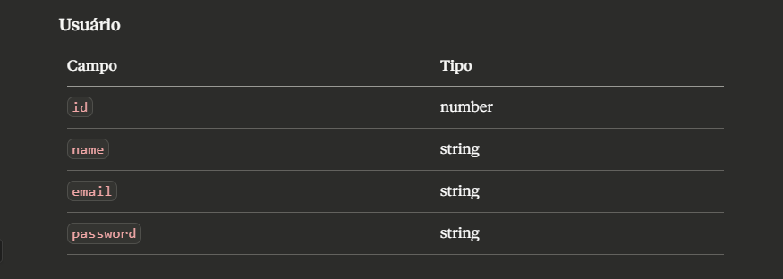
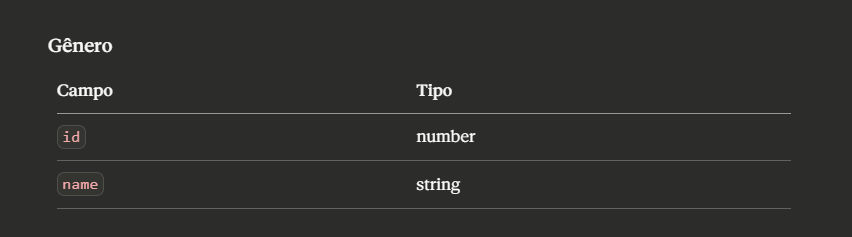
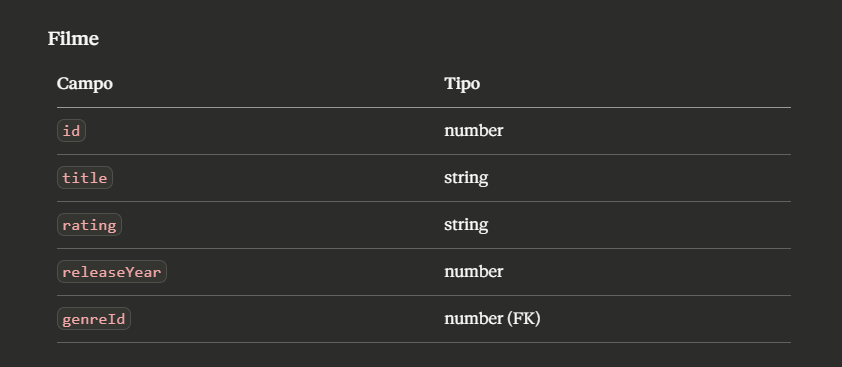
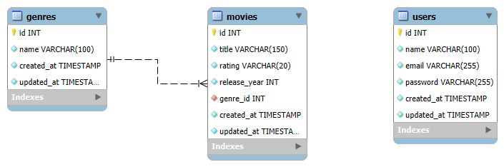

# API Catálogo de Filmes

Projeto acadêmico desenvolvido com **AdonisJS** e **PostgreSQL**, com o objetivo de aplicar na prática os conceitos de APIs REST, autenticação por token, relacionamentos entre entidades e organização de rotas no padrão AdonisJS.

---

# Contexto do Projeto

O desafio proposto foi criar uma API REST capaz de gerenciar um catálogo de filmes, cobrindo desde o cadastro de gêneros e filmes até a proteção de rotas por autenticação.

As exigências do projeto incluíam:

- Trabalhar com pelo menos duas entidades: **Gênero** e **Filme**
- Implementar o relacionamento **Gênero 1:N Filmes**
- Permitir busca de filmes por gênero
- Registrar classificação indicativa e ano de lançamento dos filmes
- Impedir o cadastro de filmes duplicados
- Utilizar **Migrations**, **Models** e **Controllers** seguindo o padrão do AdonisJS
- Proteger rotas com **Middleware de autenticação**
- Utilizar os relacionamentos do **Lucid ORM**
- Utilizar **PostgreSQL** como banco de dados
---
# Tecnologias

- AdonisJS
- Node.js
- TypeScript 
- PostgreSQL
- Lucid ORM 
- Migrations 
- VineJS 
- Middleware de autenticação 
- Docker 
- Git e GitHub 
- Bruno
---
## Entidades do Sistema

### Usuário

Representa os usuários cadastrados no sistema, responsáveis por realizar login e acessar rotas protegidas.

### Gênero

Representa as categorias às quais os filmes pertencem.

### Filme

Representa os filmes cadastrados no catálogo, cada um associado a um gênero.

### DER 

### **Relacionamento:** Gênero `1:N` Filmes — cada filme pertence a um gênero, e um gênero pode ter vários filmes.
---
## Regras de Negócio

- Gêneros e filmes podem ser cadastrados, consultados, atualizados e removidos
- Todo filme deve estar associado a um gênero existente
- Não é permitido cadastrar dois filmes com o mesmo título
- É possível filtrar filmes por gênero
- Operações de escrita (criação, edição, exclusão) exigem autenticação
- Listagem e consulta de filmes e gêneros são públicas

---
